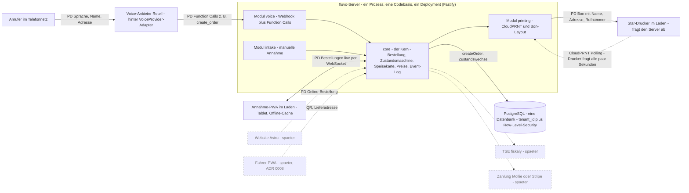

# Architekturbild fluvo — Durchstich für den Piloten

> **Status:** Entwurf (architect, 2026-09-23) — mit Sirat noch nicht durchgegangen.

**Zweck:** Ein Bild, das ohne Entwicklerausbildung lesbar ist und zeigt, *welche Technik* fluvo benutzt, *wie die Teile zusammenhängen* und *wie das System wächst*. Grundlage: [briefing.md](../../briefing.md) §4 und §5 (nicht geändert), aktualisiert um die jüngsten Entscheidungen ADR [0008](../../decisions/0008-fahrer-teil-spaeter-zwei-bons.md) bis [0013](../../decisions/0013-internetausfall-papier-statt-offline-warteschlange-im-piloten.md). Dieses Bild erfindet nichts Neues; wo etwas offen ist, steht ein Verweis auf eine Q-Nummer in [open-questions.md](../../open-questions.md).

*Fachbegriffe sind mit einem Halbsatz erklärt. „PD" markiert einen Weg, auf dem **personenbezogene Daten** (Name, Adresse, Rufnummer) fließen — jeder solche Weg braucht später in K9/DSFA eine Begründung.*

---

## 1. Gesamtbild

**Konvention:** Durchgezogene Linie = im Piloten-Durchstich gebaut. Gestrichelt = kommt später. Kantenbeschriftung mit **PD** = auf diesem Weg fließen personenbezogene Daten.

### Dasselbe in Worten

| Baustein | Was er ist (Halbsatz) | Verbindet sich mit | PD? |
|---|---|---|---|
| Anrufer im Telefonnetz | der Kunde, der anruft | Voice-Anbieter | ja |
| Voice-Anbieter Retell | fremder Dienst, der den Anruf annimmt und mit der KI spricht; **hinter einem Adapter** (austauschbare Zwischenschicht), damit ein Anbieterwechsel den Kern nicht berührt | fluvo-Server (Modul `voice`) | ja |
| fluvo-Server (Fastify) | ein einziges dauerlaufendes Programm — der **modulare Monolith**: ein Kern plus Module, die nur vom Kern abhängen | Datenbank, PWA, Drucker | — |
| `core` (Kern) | das Herz: legt jede Bestellung über **einen** Befehl `createOrder` an, schaltet ihren Zustand weiter, kennt Speisekarte und Preise, schreibt jedes Ereignis unveränderlich ins Event-Log | Datenbank, Module | — |
| Modul `voice` | nimmt die Rückmeldungen des Voice-Anbieters entgegen (Webhook = „der Fremddienst ruft fluvo zurück") und beantwortet dessen Function Calls (die KI fragt Preise/Adresse gegen die echte API ab) | Kern | ja |
| Modul `intake` | die manuelle Annahme — ein Mensch tippt eine Bestellung ein, über **denselben** Kern-Befehl wie die KI | Kern | ja |
| Modul `printing` | baut den Bon und bedient den Drucker per CloudPRNT | Drucker | ja |
| PostgreSQL | **eine** Datenbank für alle Restaurants; jede Zeile trägt `tenant_id`, und die Datenbank selbst sperrt fremde Mandanten aus (**Row-Level-Security**, kurz RLS = „Zeilen-Schutz in der DB") | Kern | ja (gespeichert) |
| Annahme-PWA | die Weboberfläche im Laden auf einem Tablet (PWA = „installierbare Web-App", läuft auch kurz offline); zeigt Bestellungen live | Kern (per WebSocket = dauerhafte Live-Verbindung) | ja |
| Star-Drucker | der Bondrucker; **er fragt den Server ab** (CloudPRNT-Polling), es läuft keine Software im Laden | Modul `printing` | ja (Bon) |
| Website, Fahrer-PWA, TSE, Zahlung | **später** (gestrichelt) — nicht Teil des ersten Durchstichs | Kern | teils |

Offen an diesem Bild: der **Geocoder** (Dienst, der eine Adresse einer Zone zuordnet) fehlt im Stack und liegt im Anruf-Pfad → Q6. Die **Telefonie/Rufumleitung** zwischen Anrufer und Retell ist noch nicht getestet → Q1, Q15.

---

## 2. Technologie je Baustein — und warum [STACK]

Aus Briefing §4 übernommen. Diese Wahl ist **Arbeitsgrundlage [STACK]**, kein [FEST] — abweichen nur mit Begründung, Rückfrage an Sirat und ADR.

| Baustein | Wahl | Warum diese Wahl (ein Satz für Sirat) |
|---|---|---|
| Sprache | **TypeScript**, Monorepo mit **pnpm** | Eine einzige Sprache für Server, Oberflächen und Website — ein Solo-Gründer muss nur einen Werkzeugkasten pflegen. |
| Prüfung von Daten | **Zod**-Schemas in einem geteilten Paket | Bestellung und Speisekarte sind **einmal** definiert und werden überall gleich geprüft — keine zweite Wahrheit. |
| Server | **Node.js + Fastify**, dauerhaft laufend (nicht serverless) | Live-Verbindungen, Voice-Rückmeldungen und das Drucker-Abfragen brauchen ein Programm, das immer läuft. |
| Datenbank | **PostgreSQL** + **Drizzle** (Übersetzer zwischen Code und DB) + **PostGIS** (Landkarten-Erweiterung für Liefergebiete) | Eine robuste Standard-Datenbank kann Mandantentrennung, Geodaten und Audit selbst — kein Extra-System nötig. |
| Ereignisse/Audit | Append-only-Tabelle `order_events` (nur anfügen, nie ändern) | Das Ereignisprotokoll ist zugleich der gesetzlich geforderte Prüfpfad (GoBD) — Kafka o. Ä. wäre unnötiger Ballast. |
| Hintergrund-Aufgaben | **pg-boss** (nutzt Postgres) | Zeitgesteuerte Jobs ohne ein zweites System wie Redis. |
| Zustandsmaschine | einfache Übergangstabelle **im Code, nur im Kern** | Der Server entscheidet jeden Schritt selbst; keine Zusatz-Bibliothek, weniger bewegliche Teile. |
| Oberflächen (Annahme, später Küche/Fahrer/Admin) | **React + Vite** als PWAs, Live per WebSocket | Installierbar ohne App-Store, laufen kurz offline (Service Worker + lokaler Speicher IndexedDB). |
| Website | **Astro**, ein Template, Domains über **Caddy** (Webserver, holt HTTPS-Zertifikate selbst) | Ein wartbares Muster für alle Restaurant-Websites statt vieler Einzelseiten. |
| Online-Zahlung | **Mollie** oder **Stripe Checkout** (gehostete Zahlseite) | fluvo berührt nie Kartendaten — die Zahlung läuft auf der Seite des Anbieters (Q7). |
| Voice | **Retell** hinter `VoiceProvider`-Adapter | Voice kaufen statt bauen; der Adapter macht einen Anbieterwechsel möglich, ohne den Kern umzubauen. |
| Bon-Druck | **Star CloudPRNT** (Drucker fragt den Server ab) | Keine Software im Laden zu installieren und zu warten. |
| TSE (Kassen-Sicherung) | **fiskaly** per API, hinter `FiscalProvider`-Adapter | Cloud-TSE statt eigener Hardware; austauschbar. |
| SaaS-Abrechnung | **Stripe Billing** mit Metern (nutzungsbasiert) | Rechnet die verbrauchten KI-Minuten automatisch ab. |
| Hosting | **Hetzner (Deutschland)**, Docker, Deploy mit Coolify oder Kamal | EU-Hosting; Docker hält die Wahl „selbst betreiben oder Managed-Dienst" offen. |
| Überwachung | **Sentry** (EU-Region), strukturierte Logs **ohne** Personendaten | Fehler früh sehen — ohne dass Kundendaten in Logs geraten. |
| Login | Inhaber per E-Mail-Link; Personal per PIN bzw. QR-Token | Kein Passwort-Aufwand für wechselndes Personal (Q11). |

**Verworfen** (Briefing §4): Supabase + Next.js, Make/Notion/Airtable als Produktivsystem, Python/FastAPI (nur für einen späteren eigenen Voice-Stack, der ohnehin getrennt liefe).

---

## 3. Was im ersten Durchstich gebaut wird — und was später

Ziel des Durchstichs: **Anruf → Bestellung → gedruckter Bon** (Briefing §7). Der Fahrer-Teil kommt **nach** dem ersten Piloten (ADR [0008](../../decisions/0008-fahrer-teil-spaeter-zwei-bons.md)); der Internetausfall wird im Piloten mit Papier überbrückt, nicht mit der Warteschlange (ADR [0013](../../decisions/0013-internetausfall-papier-statt-offline-warteschlange-im-piloten.md)).

| Repo-Baustein (Briefing §5.1) | Im Durchstich? | Rolle im Durchstich |
|---|---|---|
| `packages/core` | **ja** | Bestellung, Zustandsmaschine, Speisekarte, Preise, Event-Log, Entitlements — die nicht verhandelbare Grundlage. |
| `packages/schemas` | **ja** | Die eine Definition jeder Datenform (Zod), von allen genutzt. |
| `packages/db` | **ja** | Datenbankschema und Migrationen inkl. `tenant_id` + RLS; die Tabellen für später (`fiscal_transactions`, Teilzahlungen, Fahrer-Zuordnung) werden **schon jetzt angelegt**, bleiben im Piloten aber leer (K5, ADR 0008 Folgen). |
| `modules/voice` | **ja** | Retell-Adapter, Function Calls, Minuten-Zählung — gegen die Sandbox (Testumgebung des Anbieters). |
| `modules/printing` | **ja** | Bon-Druck über CloudPRNT; bei Lieferung **zwei Exemplare** (ADR 0008). |
| `modules/intake` | **ja (minimal)** | Manuelle Annahme über denselben `createOrder`. |
| `apps/api` | **ja** | Der Fastify-Server, der den Monolithen ausliefert. |
| `apps/web-staff` | **ja (minimal)** | Nur die Annahme-Ansicht; Küche/Fahrer/Admin-Ansichten später. |
| `modules/fiscal` | **später** | TSE-Anbindung als Code; die *Datenfelder* existieren aber ab Tag 1. Fiskalische Klärung → Q2 (Steuerberaterin, vor Pilotstart). |
| `modules/billing` | **später** | SaaS-Abrechnung der fluvo-Kunden. |
| `modules/driver` | **später** | Fahrer-App, eigene App nach dem Piloten (ADR 0008; berührt [FEST 17] → Q19). |
| `apps/site` (Website) | **später** | Provisionsfreier Bestellkanal. |
| Zahlung (`PaymentProvider`) | **später** | Online-Zahlung (Q7). |
| `modules/privacy` | **später (Grundlage jetzt)** | Auskunft/Löschung per Rufnummer; die Datenklassen dafür stehen ab K5. |

---

## 4. Wie es skaliert — ehrlich

**Wichtigster Satz zuerst:** fluvo bleibt ein **modularer Monolith [FEST 1]** — eine Codebasis, eine Datenbank, ein Deployment. Skaliert wird durch **einen größeren Server, Lesekopien der Datenbank und mehr Instanzen derselben Codebasis** — **nicht** durch Microservices. Microservices sind für einen Solo-Gründer kein Weg: sie vervielfachen die beweglichen Teile, ohne bei diesem Lastprofil einen Nutzen zu bringen.

### 4.1 Voraussetzung: Mandantentrennung ermöglicht Skalierung

Dass **jede Tabelle `tenant_id` trägt und die Datenbank fremde Mandanten per RLS aussperrt** (Briefing §5.2, Regel 6), ist nicht nur Sicherheit — es ist die **Voraussetzung zum Wachsen**: Nur so teilen sich **viele** Restaurants *eine* Datenbank und *ein* Deployment sicher. Ohne saubere Mandantentrennung müsste man je Kunde eine eigene Installation betreiben — das Gegenteil von Skalierung. Deshalb ist die Trennung im Kern von Anfang an nicht verhandelbar.

### 4.2 Was ein einzelner Server + eine Postgres grob trägt

*Die folgenden Zahlen sind eine **begründete Schätzung**, ausdrücklich **keine Messung.** Sie dienen nur der Größenordnung und müssen mit der echten Karte und einem Lasttest belegt werden.*

**Annahmen:** Ein Restaurant wie der Pilot macht ~120 Bestellungen/Tag, verteilt über mehrere Stunden mit Spitzen um die Essenszeiten. Selbst in der Spitze sind das grob **eine Bestellung pro Minute** — je Bestellung ein `createOrder` und wenige Ereignisse, also sehr wenige Schreibvorgänge. Eine mittelgroße Hetzner-Maschine (wenige Rechenkerne, ~16–32 GB Speicher) mit einer PostgreSQL bewältigt einfache Transaktionen dieser Art mit großem Abstand.

**Schätzung (so markiert):** Die begrenzende Größe ist **nicht** die Rechenlast pro Bestellung, sondern die Zahl der **gleichzeitig offenen Verbindungen** (Live-Verbindungen der Tablets, Drucker-Abfragen, Datenbank-Verbindungen). Unter diesen Annahmen erscheint eine Größenordnung von **grob mehreren Dutzend bis wenige hundert Restaurants** dieser Größe auf **einem** Server plus **einer** Postgres plausibel — bevor der erste Ausbauschritt nötig wird. Diese Spanne ist bewusst weit und **muss** durch Messung ersetzt werden.

### 4.3 Wo die ersten Grenzen liegen — und welcher Schritt hilft

| Grenze (Reihenfolge grob nach Eintritt) | Warum | Erster Schritt, der hilft |
|---|---|---|
| **Voice-Anbieter-Kontingent und -Kosten** | Retell begrenzt gleichzeitige Anrufe und rechnet **pro Minute** ab — der Preis (Kostenampel: tragfähig bis 0,15 €/Min, kritisch über 0,20 €) trifft das Geschäftsmodell, **bevor** der Server an eine Grenze kommt. Das ist eine **externe** Grenze, kein fluvo-Server-Problem. | Kontingent beim Anbieter erhöhen; Kosten je Minute beobachten (Q9); der Adapter erlaubt später einen anderen Anbieter oder einen eigenen Voice-Stack (dann ein **getrennter** Dienst, Briefing §4). |
| **PostgreSQL-Verbindungen** | Server, Hintergrund-Jobs (pg-boss) und Live-Verbindungen brauchen je eine DB-Verbindung; Postgres verträgt nicht beliebig viele gleichzeitig. | Einen **Verbindungs-Pooler** davorsetzen (bündelt viele Anfragen auf wenige DB-Verbindungen), dann eine **größere** DB-Maschine. |
| **WebSockets (Live-Verbindungen)** | Jedes Tablet hält eine dauerhafte Verbindung; mit vielen Restaurants steigt der Speicherbedarf des einen Server-Prozesses. | Zuerst **größerer Server**; dann **mehrere Instanzen derselben Codebasis** hinter einem Lastverteiler (weiter ein Monolith, nur mehrfach gestartet). |
| **Drucker-Polling-Last** | Jeder Drucker fragt alle paar Sekunden den Server ab; viele Drucker ergeben viele kleine Anfragen. | Abfrage-Intervall maßvoll wählen; die Polling-Last später als **zweiten Prozess derselben Codebasis** abtrennen (siehe unten). |
| **Lese-Last (Speisekarte, Monitoring)** | Viele Lesezugriffe (Karte, Gesundheitswerte) können die eine DB belasten. | Eine **Read-Replica** (Lesekopie der Datenbank) für Lesezugriffe. |

### 4.4 Der Ausbauweg in Stufen

1. **Größerer Server** (vertikal) — der einfachste und erste Schritt.
2. **Read-Replica** — eine Lesekopie der Datenbank nimmt Lesezugriffe ab.
3. **Voice-Webhooks als zweiter Prozess derselben Codebasis** — der zeitkritische Anruf-Pfad wird von der Oberflächen-/Live-Last getrennt, indem **dieselbe** Anwendung ein zweites Mal mit einem anderen Einstiegspunkt gestartet wird. Das ist **kein** Microservice: gleiches Repo, gleiche Datenbank, gleiches Deployment-Artefakt — nur mehrfach gestartet. So bleibt [FEST 1] gewahrt.

Erst weit jenseits des Pilotbereichs käme eine Aufteilung der Datenbank je Mandant in Betracht — das ist ausdrücklich **nicht** Gegenstand des Durchstichs.

---

## 5. Betrieb

Aus Briefing §4 und §6.

- **Hosting:** Hetzner in Deutschland (EU), alles in **Docker** (Container = abgeschlossene, überall gleich startende Programmpakete). Deploy mit Coolify oder Kamal.
- **Datenbank:** eine PostgreSQL; wahlweise selbst betrieben oder als Managed-Dienst eines EU-Anbieters (Docker hält beides offen, Q — „selbst vs. managed" im Briefing §8).
- **Backups:** **täglich und getestet** — ein Backup, das nie zurückgespielt wurde, zählt nicht.
- **Monitoring:** Sentry (EU-Region) für Fehler, strukturierte Logs **ohne** personenbezogene Daten (Regel 8, security.md).

**Minimal für den Piloten reicht:** **ein** Hetzner-Server mit Docker, **eine** PostgreSQL mit getäglichem, getestetem Backup, Sentry (EU) und eine einfache Erreichbarkeitsprüfung. Read-Replica, Pooler und ein zweiter Prozess (Abschnitt 4.4) sind erst bei Wachstum nötig — nicht im Piloten.

---

## 6. Offene Punkte

Nichts davon wird hier entschieden — Verweise auf [open-questions.md](../../open-questions.md):

- **Q1 · Rufumleitung / Telefonie:** Kommt die Anrufernummer an? Betrifft die Kante Anrufer → Retell. Test AP-001 (Termin 2026-09-25).
- **Q5 · Große Speisekarten im Voice-Prompt:** kann Größe, Kosten und Latenz treiben — Messung mit der echten Karte.
- **Q6 · Geocoder für `validate_address`:** fehlt im Stack, liegt im Anruf-Pfad, ist ein neuer Unterauftragsverarbeiter (EU-Standort). Betrifft die Zone-Zuordnung.
- **Q7 · Online-Zahlung:** Mollie oder Stripe — später, hinter `PaymentProvider`-Adapter.
- **Q8 · Lokaler Bon-Druck ohne Internet:** Test AP-002; im Piloten sonst Nachdruck + handgeschriebener Zettel (ADR 0013).
- **Q9 · Kostenampel:** Was steckt in den 0,13 €/Min? Betrifft die Voice-Grenze in Abschnitt 4.3.
- **Q11 · Login/Gerätebindung:** PIN/QR-Token, Gerätebindung — betrifft die Annahme-PWA.
- **Q13 · Statuskette und Bestellarten:** die feste Kette passt noch nicht auf alle Bestellarten → K3 mit `architect`, berührt [FEST 2].
- **Q15 · KI außerhalb der Öffnungszeit vs. Rufumleitung:** deterministische Trennung, hängt an AP-001.
- **Selbst betriebener Server vs. Managed-Dienst** (Briefing §8): Docker hält beides offen; Sirat entscheidet nach Betriebserfahrung.

---

## Verknüpfungen

- Quelle der Wahrheit: [briefing.md](../../briefing.md) §2 (feste Entscheidungen), §4 (Stack), §5 (Architektur).
- Vorgehen dazu: ADR [0014](../../decisions/0014-vorgehen-durchstich-spur.md) (Durchstich-Spur).
- Nächste Modelle: K3 [Zustandsmodell](zustand-bestellung.md), K5 Datenmodell (ER + Datenwörterbuch).
- Zehn Regeln, die dieses Bild einhält: [CLAUDE.md](../../../CLAUDE.md).
