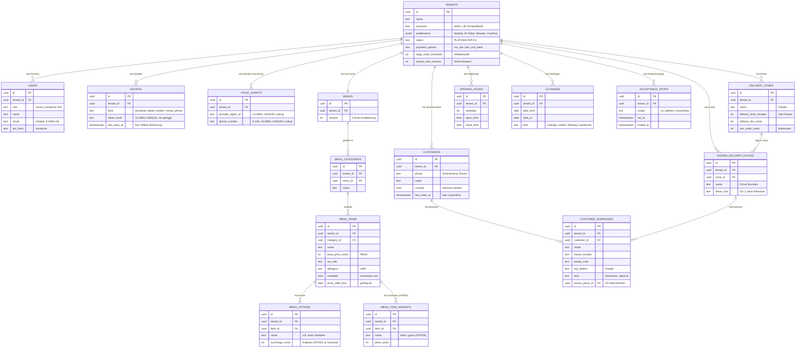
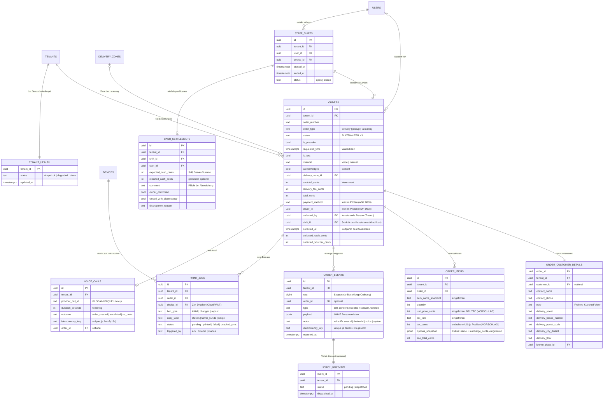

# K5 · Datenmodell (ER) für den Piloten-Durchstich

- **Status:** Entwurf — Gegenlesen DB + Compliance 2026-09-23 eingearbeitet; Durchgang mit Sirat steht aus; offene Entscheidungen: siehe Fragen · **Paket:** AP-007 · **Skill:** `konzept-diagramme`
- **Zweck:** Zeigt die Tabellen, die der Durchstich **Anruf → Bestellung → Bon (+ Kassieren am Tresen)** braucht, mit ihren Beziehungen. Nur Schlüssel und tragende Felder stehen im Bild; jedes Feld mit Typ, Pflicht und Datenklasse steht im **Datenwörterbuch** ([../vertraege/datenwoerterbuch.md](../vertraege/datenwoerterbuch.md)).
- **Maßgeblich ist die Wort-Tabelle** unter dem Bild. Laufen Bild und Tabelle auseinander, ist das ein Befund.

> **Grenzen dieses Artefakts.** Konzipiert wird nur der Piloten-Durchstich. **Nicht Teil dieses Artefakts** (kommen später, unten als Liste): `drivers`, `driver_shifts`, `payments` (Teilzahlungen je Zahlart), `fiscal_transactions` (TSE), `domains`/Website. Die **Bestellzustände** werden hier **nicht** festgelegt — das macht K3 ([zustand-bestellung.md](zustand-bestellung.md), parallel). `orders.status` und `tenants.status` stehen deshalb nur als **Platzhalter**.
>
> **Regeln, die im ganzen Modell gelten** ([FEST], Briefing §5.2, CLAUDE.md 6/7/8):
> - **Jede Tabelle trägt `tenant_id`** und hat Row-Level-Security (im Bild nur einmal erwähnt, sonst unlesbar). Bei der Übersetzung ist `tenant_id not null references tenants(id)` **und** die RLS-Policy je Tabelle in **derselben** Migration zu setzen — auch für alle Speisekarten-Tabellen (`menu_categories/items/options/variants`), wo `tenant_id` sonst nur per Konvention getragen wäre (DB 1.6).
> - **Zusammengesetzte Fremdschlüssel `(tenant_id, id)`** als Konvention: Jeder Verweis innerhalb eines Tenants (`menu_id`, `category_id`, `item_id`, `order_id`, `customer_id`, `delivery_zone_id`, `shift_id`, `collected_by`, `known_place_id`, `device_id` …) referenziert zusammengesetzt `(tenant_id, id)` auf ein zusammengesetztes Unique/PK der Elterntabelle, damit keine FK-Kette auf einen fremden Tenant zeigt und RLS nicht umgangen wird (Skill `fluvo-multi-tenant`, DB 1.1). Im Bild sind FKs der Lesbarkeit halber einspaltig gezeichnet; maßgeblich ist die zusammengesetzte Form.
> - **Je-Tenant-Eindeutigkeit statt globaler Serials:** `unique (tenant_id, order_number)` mit **je-Tenant-Zähler** (nie globaler Serial — verrät Fremdvolumen; DB 1.2) · `unique (tenant_id)` auf `menus` (DB 1.3) · `unique (tenant_id, idempotency_key)` auf `order_events` (partiell, wo gesetzt) und `voice_calls` (DB 2.2/3.1). **Ausnahme — tenant-agnostische Nachschlagschlüssel**, global eindeutig, weil sie *vor* gesetztem Tenant gelesen werden: `devices.token_hash`, `voice_calls.provider_call_id` und die Zuordnung `phone_numbers`/`voice_agents` (Anbieter-ID → Tenant). Diese Lookups leiten den Tenant ab und betreten dann `withTenant` — **kein `BYPASSRLS`** (DB 1.4/1.5).
> - **Geld immer als Ganzzahl in Cent** (Typname `Cents`). Rundung an **einer** Stelle im Kern, Währung EUR als Annahme (Single-Currency; DB 4.3).
> - **Zeitpunkte in UTC**, Anzeige in der Zeitzone des Restaurants. Diese Zeitzone steht als `tenants.timezone` (IANA, z. B. Europe/Berlin) und trägt jede Tagesgrenze, Öffnungsprüfung, Vorbestellung und den Tagesabschluss (DB 6.1).
> - **`order_events` und Kassendaten sind append-only** — nie `UPDATE`/`DELETE` (GoBD-Audit-Trail). Der Verarbeitungs-/Dispatch-Zustand des In-Process-Verteilers liegt deshalb in einer **eigenen** Tabelle `event_dispatch` (Outbox-Cursor); `order_events` bleibt reines INSERT/SELECT (DB 2.3). `order_events` trägt eine **Sequenz** `seq` je Bestellung, damit die Reihenfolge nie allein an `occurred_at` hängt (DB 2.1).
> - **Kein Audio, kein dauerhaftes Volltranskript**, keine Personendaten in Event-Nutzlasten. Freitextfelder (`note`, `driver_hint`, `cash_settlements.comment`/`discrepancy_reason`, `closures.note`) gelangen **nie** in `order_events`, Logs, Sentry, Fehlermeldungen, URLs oder an den Voice-Anbieter (DB C B4/B10).
> - **Zwei Datenklassen** aus Briefing §5.2, hier um eine dritte (rein betriebliche) ergänzt, damit Stammdaten nicht fälschlich als Buchungsdaten gelten:
>   - **(a) DSGVO-löschbar** — Kundenstamm, Rufnummer, Adresse, Freitext.
>   - **(b) GoBD-pflichtig, 10 Jahre** — Bestellung, Positionen, Events, Kassenabschluss. **Enthält keinen Personenbezug, nur Verweise.**
>   - **(c) betrieblich** — Speisekarte, Zonen, Öffnungszeiten, Geräte. Kein Personenbezug eines Kunden, keine Buchung.
>   - **Löschung = ganze personenbezogene Zeile entfernen, der Beleg bleibt** (Briefing §5.2). Deshalb liegen die personenbezogenen Felder einer Bestellung in einer **eigenen** Tabelle (`order_customer_details`, Klasse a), getrennt von der Bestellung selbst (`orders`, Klasse b). Der Löschweg ist **Zeile löschen** (nicht in-place pseudonymisieren), damit NOT-NULL-Felder konsistent bleiben; `orders.customer_id`-Bezug entfällt mit `ON DELETE SET NULL` (DB 5.2, C-Antwort 2).
>
> **Frage an Sirat / architect (C B1):** Die dritte Datenklasse **(c) betrieblich** weicht von Briefing §5.2 (zwei Klassen) ab; open-questions Q10 hält die Abweichung als „nicht entschieden" fest. Vor der ersten Migration durch `architect` + Sirat freigeben. Die K5-Lesart (c) = Speisekarte/Zonen/Geräte, **ohne** Kundenbezug oder Buchung — nicht zu vermischen mit einem Vorschlag „Kundenstamm/Lieferdaten/Fiskaldaten".

## Diagramm 1 — Stammdaten (Restaurant, Speisekarte, Zonen, Kunden)

## Diagramm 2 — Bestellung, Bon, Anruf, Tresen-Abschluss

## Die Tabellen in Worten (maßgeblich)

Kurz und in Alltagssprache. `K` = Datenklasse (a/b/c, siehe oben). Details je Feld im Datenwörterbuch.

| Tabelle | Was sie in Alltagssprache ist | K | Herkunft (FA) |
|---|---|---|---|
| `tenants` | Ein Restaurant (Mandant). Trägt Name, gebuchte Module/Minuten (Entitlements), und die Betriebs-Stammdaten, die es nur einmal gibt: welche Zahlungsmöglichkeiten es bei Lieferung gibt, ab welcher Artikelanzahl eine Bestellung eine „Großbestellung" ist, und wie lange Abholung ca. dauert. | c | FA-20/21/22, FA-01, FA-17 |
| `users` | Die Menschen, die im Restaurant arbeiten: Inhaber (meldet sich per E-Mail-Link an) und Annahme-Personal (meldet sich per PIN am registrierten Gerät an). **Beschäftigtendaten** — wird **deaktiviert** (`active=false`), nicht kundengelöscht; ein Klasse-(a)-Löschjob darf `users` nicht erfassen, er läuft tabellen-/regelscharf (C B2). Eigene arbeitsrechtliche Frist → Anwalt A5. | a | FA-19, FA-20, K9 |
| `devices` | Die angemeldeten Geräte des Restaurants: Annahme-Tablet, Drucker, registriertes Inhaber-Handy. `last_seen_at` erlaubt dem Server zu merken, wenn das Annahme-Gerät offline ist (dann pausiert die KI, ADR 0013). | c | FA-14, FA-16, FA-19, FA-20 |
| `menus` | Die eine Speisekarte des Restaurants (genau eine Wahrheit). Trägt eine Versionsnummer, damit KI-Prompt und Offline-Cache wissen, ob sie neu laden müssen. | c | FA-12, [FEST 3/9] |
| `menu_categories` | Die Rubriken der Karte (z. B. „Pizza", „Getränke"). | c | FA-12 |
| `menu_items` | Ein Gericht auf der Karte: Name, Preis (Pflicht — ohne Preis wird nichts angelegt), Steuersatz, Allergene, ob es gerade verfügbar ist („momentan aus"), und ab wann ein geänderter Preis gilt. | c | FA-12 |
| `menu_options` | Bepreiste Extras zu einem Gericht („extra Zwiebeln"). Der Aufpreis **hängt von der Größe/Variante ab** — wie genau das hinterlegt wird, ist **offen** (siehe Fragen). | c | FA-12, FA-01 (Runde 51) |
| `menu_item_variants` | Größen/Varianten eines Gerichts (z. B. „klein"/„groß"). **Nur als Platzhalter — offen**, ob und wie Varianten modelliert werden. | c | FA-12 (Runde 51) — **OFFEN** |
| `delivery_zones` | Die Lieferzonen (als Ortsteile beschrieben). Jede Zone trägt drei Werte: Lieferzeit, Liefergebühr, Mindestbestellwert (auf den Warenwert). Das Modell nutzt **bewusst kein** PostGIS-Polygon: Zuordnung Adresse→Ortsteil per Geocoder (Q6) — begründete Abweichung von der generischen „ST_Contains/GiST"-Regel, konsistent mit FA-17 B18 (Sirats Entscheidung „nicht als gezeichnete Fläche"), kein Versäumnis (DB 8.1). | c | FA-17 |
| `known_delivery_places` | Orte, die Anrufer nennen statt einer Straße („Firma Soundso", „am See wie immer"). Trägt Name, Zone und einen Fahrer-Hinweis. **Kann Personenbezug tragen** (Firmenname, Fahrer-Hinweis) — hat aber **keinen** Rufnummern-Bezug, deshalb müssen Auskunft/Löschung diese Tabelle über Namens-/Freitextsuche ausdrücklich erfassen (C B8). `driver_hint` gelangt nie in Events/Logs/URLs/an den Voice-Anbieter (C B10). Löschfrist/-schlüssel offen → Frage A3 (C B9). | a | FA-24 |
| `opening_hours` | Die Öffnungszeiten je Wochentag — mit **mehreren Zeitfenstern** je Tag (Mittagspause). | c | FA-18 |
| `closures` | Ruhetage, Urlaub, Feiertage und abweichende Einzeltage. | c | FA-18 |
| `acceptance_stops` | Ein von Hand gesetzter Annahmestopp: „keine Lieferung mehr" oder „gar nichts mehr". Endet von Hand, spätestens am Ladenschluss. | c | FA-23 |
| `customers` | Ein Stammkunde eines Restaurants — nur wenn er zugestimmt hat, dass die Adresse gemerkt wird. Schlüssel ist die **E.164-normalisierte** Rufnummer je Restaurant (sonst matchen „030…"/„+49 30…" nicht; C B7, Briefing §6). `last_order_at` steuert die Löschfrist. Der Einwilligungs-Nachweis (auch „Nein" und Widerruf) liegt append-only in `order_events` (siehe unten), nicht nur als Ist-Zustand `consent`. | a | FA-01 (Weg B), FA-02 |
| `customer_addresses` | Die gemerkte(n) Adresse(n) eines Stammkunden, strukturiert (Straße, Hausnummer, PLZ, Ortsteil, Stockwerk) — oder statt einer Adresse ein bekannter Lieferort. | a | FA-01, FA-24 |
| `orders` | Eine Bestellung — **ohne** die personenbezogenen Felder. Trägt Bestellart, Zustand (→ K3), Vorbestellung ja/nein, Zone, die vom Server gerechneten Summen und die Tresen-Barerfassung. `shift_id` und `collected_at` binden das Kassieren an die Schicht, damit der Abschluss je Mitarbeiter ohne Zeitfenster-Join sauber summiert (DB 7.2). Bestellnummer ist je Restaurant eindeutig und wird per Je-Tenant-Zähler vergeben (DB 1.2). Felder für Fahrer und Zahlart sind da, bleiben im Piloten leer (ADR 0008). | b | FA-01, FA-05, FA-11, FA-15 |
| `order_customer_details` | Die personenbezogenen Felder **einer** Bestellung: Name, Rufnummer, Lieferadresse, Notiz. **Getrennt von `orders`**, damit die Löschung (ganze Zeile) genau hier greift und der Beleg bleibt. `contact_phone` kann **ohne** `customers`-Zeile existieren (Kunde sagte „Nein") — Auskunft/Löschung per Rufnummer müssen diese Tabelle direkt erfassen (C B8). `note` gelangt nie in Events/Logs/Sentry/URLs/an den Voice-Anbieter, nur auf Bon und an Küche/Fahrer; die KI erfragt keine Gesundheitsdaten (C B10, → K4). | a | FA-01, FA-05 (Runde 51) |
| `order_items` | Die Positionen einer Bestellung, mit **eingefrorenem** Artikeltext, Einzelpreis, Steuersatz und gewählten Extras. Preis ist **brutto** (Gastro-üblich) und je Position wird der enthaltene Steuerbetrag (`tax_cents`) mitgeführt, damit die USt-Aufteilung je Satz für Beleg/GoBD/DSFinV-K nachrechenbar ist — als **[VORSCHLAG]**, Brutto/Netto-Festlegung ist eine Steuerberaterin-Frage (DB 4.1, S-Frage). `options_snapshot` folgt einem festen Schema (`name`, `surcharge_cents`), damit `line_total = (unit_price + Σ surcharge) × quantity` prüfbar bleibt (DB 4.2). Hängen nie an der aktuellen Karte. | b | FA-01, §5.2 |
| `order_events` | Das unveränderliche Ereignisprotokoll: angelegt, quittiert, geändert, storniert (mit Grund), kassiert, abgeschlossen sowie der **Einwilligungs-Nachweis** (`consent.recorded`/`consent.revoked`, siehe unten). Trägt eine Sequenz `seq` je Bestellung (deterministische Ordnung), einen je Tenant eindeutigen `idempotency_key` (wo gesetzt) und `actor` als reine ID. **Append-only, ohne Personendaten** — der GoBD-Audit-Trail und das Inhaber-Log. Der Verteil-/Dispatch-Zustand liegt getrennt in `event_dispatch`. | b | alle FA, [FEST 7] |
| `event_dispatch` | Der Verarbeitungs-Zustand des In-Process-Verteilers je Event (pending/dispatched). **Getrennt** von `order_events`, weil `fluvo_app` dort nur INSERT/SELECT darf und die Outbox einen Cursor braucht (DB 2.3). | c | K6, [FEST 7] |
| `voice_agents` | Zuordnung Voice-Anbieter-ID / Rufnummer → Restaurant. Der eingehende Voice-Webhook löst darüber den Tenant auf, **bevor** ein `voice_calls`-Satz existiert. Lookup-Schlüssel sind **global eindeutig** und werden tenant-agnostisch gelesen (kein `BYPASSRLS`, DB 1.5). | c | FA-01, `fluvo-multi-tenant` |
| `tenant_health` | Ein Aggregat je Restaurant für die Betreiber-Übersicht (Ampel/Metrik), **ohne** Bestellungen, Kundendaten oder Bestellnummern. Skizze — die Betreiber-Rolle sieht nur diese Projektion, keine Rows aus `orders`/`order_customer_details`/`order_items`/`voice_calls` (C B11, → K9/Q16). | c | FA-22, Briefing §6/§8 |
| `voice_calls` | Was von einem KI-Anruf bleibt: Dauer in Sekunden (fürs Minuten-Metering), Ausgang, ein **eindeutiger** Schlüssel je Anruf (Idempotenz, 13a), die **global eindeutige** `provider_call_id` (Webhook-Zuordnung vor gesetztem Tenant; nie in URLs/Logs). **Kein Audio, kein Transkript, keine Rufnummer.** Aufbewahrungsfrist der Metadaten offen → Frage A6 (C B12). | b | FA-01 (13a), §5.4 |
| `print_jobs` | Ein Bon-Druckauftrag: welche Art (Erst-/geänderter/Nachdruck), welches Exemplar (Station / Fahrer-Kunde / einzeln), Status, wodurch ausgelöst (Quittierung / 2-Minuten-Notdruck / Nachdruck von Hand). Trägt den **Ziel-Drucker** `device_id`, damit das CloudPRNT-Polling je Drucker seine offenen Aufträge filtern kann (DB 7.1); Doppel-Aufträge (Quittierung + Timeout, doppelte Quittierung) sind über Eindeutigkeit/Idempotenz ausgeschlossen (DB 3.3). Ein Nachdruck eines Liefer-Bons nach der Löschung zeigt **ohne** Name/Adresse/Telefon (DB 5.3). | c | FA-06 |
| `staff_shifts` | Die Tresen-Schicht einer Person: Anmeldung am Gerät, offen/geschlossen. Grundlage dafür, dass jedes Kassieren einer Person zugeordnet ist. **Kein Wechselgeld-Start** (ADR 0012). Trägt über `user_id` **Beschäftigtendaten** (Arbeitszeit) — eigene Aufbewahrung, nicht der Kundenlöschung unterworfen (C B3, Frist → Anwalt A5). | c | FA-19 |
| `cash_settlements` | Der Abschluss **je Mitarbeiter** am Tresen: der vom Server gerechnete Soll-Betrag (Summe des bar Kassierten), der gemeldete Betrag mit Pflicht-Kommentar bei Abweichung, die Bestätigung des Inhabers. **Kein Wechselgeld** (ADR 0012). Append-only. `comment`/`discrepancy_reason` sind Belegfreitexte und dürfen **keinen Personenbezug** aufnehmen (C B4); über `user_id` Beschäftigtenbezug (C B3). | b | FA-16 |

## Verknüpfungen (Rückverfolgung)

- **`orders` ↔ K3:** `orders.status` ist der Platzhalter für die Zustandsmaschine (K3, [FEST 4]). Übergänge, benannte Enden („nie abgeholt", „nicht zustellbar") und das Merkmal „quittiert" klärt K3/Q13.
- **`order_events` ↔ K6:** Der Ereignis-Katalog (Namen, Nutzlasten) entsteht in K6. Vorläufige Namen aus den FA: `order.created`, `order.acknowledged`, `order.changed`, `order.cancelled`, `menu.updated`, `counter.shift_settled`, `delivery_place.upserted`, **`consent.recorded`, `consent.revoked`** (Einwilligungs-Nachweis, siehe unten).
- **Einwilligungs-Nachweis ↔ ADR 0007 §K5 / FA-01 T5 (C B5/B6):** Auch ein „Nein" und ein Widerruf werden festgehalten — **append-only** als `order_events`-Ereignis `consent.recorded` (mit **Fragetext-Version**, Antwort **Ja/Nein**, Bezug order/call, `occurred_at`, `actor` — **ohne Name/Rufnummer/Audio**) bzw. `consent.revoked`; Folge des Widerrufs: der Kundeneintrag wird gelöscht. `customers.consent` bleibt nur der Ist-Zustand.
- **`orders`/`order_customer_details` ↔ FA-01/FA-05:** `createOrder` schreibt beide in einer Transaktion und friert `order_items` ein.
- **`voice_calls.idempotency_key` ↔ FA-01 (13a):** ein **eindeutiger** Schlüssel je Anruf; ein Wiederholungsversuch erzeugt keine zweite Bestellung (K6).
- **`cash_settlements` ↔ FA-16/FA-19:** hängt an `staff_shifts`; Soll = Summe der `orders.collected_cash_cents` dieser Person in der Schicht — sauber über `orders.shift_id` (nicht per Zeitfenster-Join; DB 7.2).
- **`event_dispatch` ↔ K6:** Der Verteil-/Verarbeitet-Zustand liegt außerhalb von `order_events`; der Verteiler markiert dort, `order_events` bleibt INSERT/SELECT (DB 2.3).
- **Hintergrund-Jobs ↔ K6 (DB 7.4):** Vorbestellungs-Fälligkeit und Löschfristen laufen als pg-boss-Jobs **ohne Session-Tenant** — der Job iteriert Tenant für Tenant mit `withTenant` (bzw. setzt `tenantId` aus dem Payload), **nie `BYPASSRLS`**. Als Regel in K6 verankern.
- **Mandantentrennung ↔ `fluvo-multi-tenant`:** `tenant_id` auf jeder Tabelle, RLS-Policy je Tabelle in derselben Migration, zusammengesetzte Fremdschlüssel `(tenant_id, …)`, Zwei-Tenant-Test je Route/Abfrage.
- **Betreiber-Sicht ↔ FA-22/K9 (C B11):** Das Aggregat `tenant_health` ist die einzige Betreiber-Quelle; die Betreiber-Rolle hat **keinen** Row-Zugriff auf `orders`/`order_customer_details`/`order_items`/`voice_calls` (→ K9, Q16).

## Nicht Teil dieses Artefakts (kommt später)

Als Verweise mitgedacht, aber **nicht** für den ersten Piloten modelliert:

- `drivers`, `driver_shifts` — Fahrer-Teil als eigene App nach dem Piloten (ADR 0008). Felder `orders.driver_id` und `orders.payment_method` sind schon da, bleiben leer.
- `payments` — allgemeine Teilzahlungen je Zahlart (Karte, online, Fahrer-Bargeld). Im Piloten wird die Tresen-Barzahlung als Felder an `orders` erfasst (`collected_*`); die generische Tabelle kommt mit Karte/Online/Fahrer (Q2, K6).
- `fiscal_transactions` — TSE-Signaturen, DSFinV-K (Q2/Q5/Q11, Steuerberaterin).
- `domains`/Website — Restaurant-Website als eigener Kanal (Briefing §3, später).

## Offene Fragen

> **Frage an Sirat (Options-/Varianten-Modell, FA-12 Runde 51):** Extra-Zutaten sind bepreiste Optionen mit **größen-/variantenabhängigem Aufpreis** (Beispiel: kleine Pizza, extra Zwiebel = 50 Cent). Wie wird das hinterlegt — **eine `menu_item_variants`-Tabelle (Größen)** mit **je Variante eigenem Aufpreis je Extra**, oder eine **Faktor-/Staffelregel**? Davon hängt ab, ob `menu_options.surcharge_cents` ein fester Wert bleibt oder je Variante existiert. → offen, wird in FA-12/K5 vertieft.

> **Frage an den Anwalt (Q10 / A3, C B9): Löschfrist und Datenklasse `known_delivery_places` (FA-24).** Ein bekannter Lieferort kann Personenbezug tragen (Firmenname, Kundenbezeichnung, Fahrer-Hinweis mit Namen) und hat **keinen** Rufnummern-Bezug, an dem ein Löschjob ansetzen könnte. Hier vorläufig **(a)** eingeordnet. Welche Datenklasse und Löschfrist gelten — Stammdaten mit dokumentierter Aufbewahrung oder Nutzungszeitpunkt (`last_used_at`) ergänzen? (In Runde 51 nicht entschieden.)

> **Frage an den Anwalt (Q10 / A4, C B10): Aufbewahrung/Behandlung des Notizfeldes (`order_customer_details.note`).** Freitext an Küche/Fahrer, hier als Personendaten **(a)** an der Bestellung geführt; kann Namen Dritter oder Gesundheitsdaten (Art. 9) enthalten. Wird die Notiz mit dem übrigen Personenbezug nach Frist gelöscht — und genügt bei genannten Gesundheitsdaten die reine Weitergabe an die Küche, während die KI angewiesen ist, solche Angaben **nicht** aktiv zu erfragen (K4)?

> **Frage an den Anwalt (Q10 / A6, C B12): Aufbewahrung `voice_calls`-Metadaten.** Dauer, Ausgang und Schlüssel je Anruf sind für Metering/Abrechnung (b). Wie lange bleiben die personenfreien Anruf-Metadaten? Kein Audio, keine Rufnummer — aber die Frist ist nicht festgelegt (open-questions.md Q10 nennt `voice_calls` ausdrücklich).

> **Frage an den Anwalt (A5, C B3): Aufbewahrung von Beschäftigtendaten** (`users`, `staff_shifts`, `cash_settlements` je Mitarbeiter) — abgegrenzt von der Kundenlöschung (§ 26 BDSG).

> **Frage an Sirat / architect: „Gültig ab"-Preis in der Zukunft (FA-12).** `menu_items.price_valid_from` trägt **einen** Stichtag. Ein **künftig geplanter** Preis (heute alt, ab Datum X neu) braucht entweder eine Preis-Historie/`menu_item_scheduled_prices` oder einen geplanten Änderungssatz. Hier noch nicht modelliert → K5/K6.

> **Frage an die Steuerberaterin (DB 4.1 / S1, ergänzend):** Ist der eingefrorene Positionspreis **brutto** (im Modell als [VORSCHLAG] so gesetzt) und genügt es, den enthaltenen Steuerbetrag je Position (`tax_cents`) zu speichern — oder verlangt DSFinV-K die Netto-Führung bzw. eine andere Aufteilung? Erst nach Antwort wird das [VORSCHLAG] verbindlich; die Zeilen sind danach unveränderlich.

> **Frage an die Steuerberaterin (C B13 / S2):** Darf eine als Test markierte Bestellung (`orders.is_test`) an die TSE, oder muss sie fiskalisch außen vor bleiben? → Q2.

> **Frage an Sirat / architect (C B1):** Freigabe der dritten Datenklasse (c) — siehe Regelblock oben.

> **Modellentscheidung (technisch, [STACK], nicht Produktwahrheit):** Tresen-Barzahlung im Piloten als Felder an `orders` (`collected_by`, `collected_cash_cents`, `collected_voucher_cents`) statt als generische `payments`-Tabelle. Grund: Teilzahlungen je Zahlart, Karte, online und Fahrer kommen erst später (ADR 0008). Ob das so bleibt oder früh auf eine `payments`-Tabelle umgestellt wird, klärt K6 zusammen mit Q2 (Steuerberaterin, DSFinV-K).
