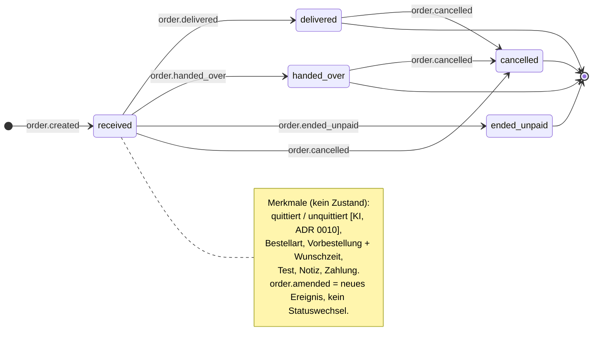

# K3 · Zustandsmodell der Bestellung (Piloten-Durchstich)

**Status:** Entwurf — Gegenlesen `architect` 2026-09-23 eingearbeitet; **Q13 entschieden (ADR 0015)**, **Rest-Unterpunkte 1 und 2 sowie `ended_unpaid` als eigenes Ende entschieden (Runde 53, 2026-09-23)**, **Tagesabschluss blockiert bei offenen Bestellungen entschieden (Runde 55, Q31, 2026-09-23)**; **Durchgang mit Sirat erfolgt** (Runden 52–55); Kreuzverhör und Abnahme stehen aus

**Zweck:** Festlegen, welche Zustände eine Bestellung im **Piloten** durchläuft, wer welchen Übergang auslöst, was er bewirkt und wie Storno, Doppelklick, Notdruck und „Rückruf nötig" abgebildet werden. Maßgeblich ist die **Übergangstabelle**; weicht sie vom Diagramm ab, ist das ein Befund.

> **Berührt [FEST 2] / Briefing §5.3 — nicht still überschrieben.** Die feste Kette lautet `Eingegangen → In Küche → Fertig → Unterwegs → Geliefert → Abgerechnet` mit Storno als eigenem Pfad. Der Piloten-Schnitt (ADR 0006/0008/0010/0013) benutzt davon nur eine **Teilmenge** und ergänzt zwei Enden (Tresen-Übergabe, Ende ohne Bezahlung). Der reduzierte Weg ist **entschieden** ([ENTSCHIEDEN Sirat 2026-09-23], **ADR 0015**, Runden 52–53), gilt aber nur für den Piloten; die **Änderung von Briefing §5.3 bleibt Sirats Sache** und ist offen. Die vollen Zustände bleiben im Datenmodell (K5) vorgesehen.

## Zustandsdiagramm (Pilot)

**Legende / Zustände im Piloten**

| Zustand (Code / Deutsch) | Bedeutung | Terminal? |
|---|---|---|
| `received` / Eingegangen | Bestellung ist angelegt (Startzustand jeder Bestellung, jeder Bestellart). Küchen-Status werden im Piloten **nicht** gesetzt, die Bestellung bleibt hier bis zum Endübergang. | nein |
| `delivered` / Geliefert | Lieferung: die Annahme hat „geliefert" gedrückt (kein Fahrer, keine Zahlart im System, ADR 0008). | ja |
| `handed_over` / Übergeben und bezahlt | Abholung/Mitnehmen: am Tresen übergeben **und** bezahlt (bar/Gutschein, FA-15). | ja |
| `ended_unpaid` / Ohne Bezahlung beendet | Nie abgeholt/nie kassiert: **eigenes** Ende mit Pflichtgrund durch Annahme oder Inhaber (FA-15/FA-16), getrennt vom Storno-Pfad, mit eigenem Ereignis `order.ended_unpaid` — damit Schwund und Storno getrennt auswertbar sind ([ENTSCHIEDEN Sirat 2026-09-23], Runde 53). Die **fiskalische** Behandlung bleibt offen (Q3, Steuerberaterin). | ja |
| `cancelled` / Storniert | Storno als eigener, protokollierter Pfad, mit Grund und Akteur (FA-11). | ja |

**Erst mit dem Fahrer-Teil / später (nicht Teil dieses Modells, ADR 0008; Q13):**
`in_kitchen` / In Küche und `ready` / Fertig — im Piloten **nicht von Hand gesetzt** (keine Küchen-Status); `out_for_delivery` / Unterwegs — **kein Fahrer** im Piloten; `settled` / Abgerechnet — im Piloten **kein** Bestellstatus: **`delivered` ist im Piloten das Ende einer Lieferung, es folgt kein „Abgerechnet"** ([ENTSCHIEDEN Sirat 2026-09-23], Runde 53). Die Geldabrechnung der Lieferungen läuft im Piloten **auf Papier** (ADR 0008) und ändert keinen Bestellstatus; die Tresen-Abrechnung ist ein Aggregat je Mitarbeiter (FA-16). `settled` wird **später mit der Fahrer-App** zwischen `delivered` und dem Ende eingeschoben (ADR 0015 Punkt 4).

**Zukunftssicherheit — Vorgabe für K5/Code.** Das spätere Einschieben der FEST-Zustände (`in_kitchen`/`ready`/`out_for_delivery`/`settled`) **zwischen** `received` und den heutigen Enden ist unkritisch, weil das Event-Log **Tatsachen** protokolliert, nicht den Graphen: historische `order_events` bleiben gültig, egal wie die Übergangstabelle später aussieht ([FEST 7], kein Daten-Rückbau). Damit das trägt, gelten drei Vorgaben:

- **`OrderStatus` als String-Literal-Union aus dem Zod-Schema plus Textspalte** (ggf. mit CHECK-Constraint, per neuer Migration ersetzbar) — **kein** Postgres-`ENUM`-Typ (schwer erweiter- und umsortierbar; deckt sich mit `typescript.md` „keine enums").
- **„offen" vs. „terminal" nicht an einzelne Statuswerte binden.** Nicht `status = 'received'` als „offen" verdrahten, sonst brechen Monitoring/Listen beim Einschieben neuer Zustände. Stattdessen **abgeleitete Mengen** `OPEN_STATES` / `TERMINAL_STATES` an **einer** Stelle im Kern definieren.
- **Ereignisnamen bleiben bedeutungsstabil** (`order.delivered` heißt „Lieferung abgeschlossen" — bleibt gültig, auch wenn später `out_for_delivery → delivered` davorsteht); jedes Übergangs-Event trägt `from`/`to` im Payload, damit der Trail bei wachsender Tabelle lesbar bleibt.

## Übergangstabelle

| Von → Nach | Auslöser (wer) | Bedingung | Ereignis (K6 vorläufig) | Nebenwirkung | Quelle |
|---|---|---|---|---|---|
| — → `received` | KI/System (FA-01) **oder** Annahme von Hand (FA-05) | KI: ausdrückliche Bestätigung des Anrufers. Hand: Anlegen. Vorher Prüfung Entitlements → Öffnungszeit → Speisekarte → Liefergebiet → Mindestbestellwert; Preise/Texte eingefroren | `order.created` (actor `voice` \| user) | KI: **kein** Sofort-Bon, Annahme-Gerät **signalisiert**. Hand: gilt als **direkt quittiert** → Bon sofort | Briefing §5.3/§5.4, FA-01, FA-05 |
| `received` → `delivered` | Annahme | Bestellart **Lieferung**; die Annahme weiß, dass geliefert wurde | `order.delivered` (actor user) | **Keine** Zahlart, **kein** Bar-Eingang erfasst (Papier, ADR 0008) | ADR 0008 (Runde 26), FA-06, Q13 |
| `received` → `handed_over` | Annahme (angemeldete kassierende Person) | Bestellart **Abholung/Mitnehmen**; am Tresen übergeben; Zahlung ist erfasst (Mitnehmen bereits bei Anlage, Abholung spätestens bei Übergabe) | `order.handed_over` (actor user) | Bareinnahme fließt in den Abschluss je Mitarbeiter (FA-16), **nicht** in einen Fahrer-Kassensturz | FA-15, FA-16 |
| `received` → `ended_unpaid` | Annahme (mit Pflichtgrund) **oder** Inhaber | Bon gedruckt, nie kassiert/übergeben (z. B. nie abgeholt) **oder** am Tagesende bewusst ohne Bezahlung beendet (FA-16); **Grund Pflicht**; per Definition **ohne** erfasste Zahlung | `order.ended_unpaid` (Grund, actor) | Sichtbar in der Liste offener/nicht kassierter Bestellungen (FA-16); protokolliert im Inhaber-Log; **eigenes** Ende getrennt vom Storno (Schwund ≠ Annullierung) | FA-15 (2a), FA-16 (3a), ADR 0010, ADR 0015; Runde 53; fiskalisch Q3 |
| `received` → `cancelled` | Annahme, **solange keine Zahlung erfasst**; sonst **nur Inhaber** | Storno; **Grund Pflicht**; Küche organisatorisch abgeklärt (kein Küchen-Status im System). Achtung: ein bezahltes **Mitnehmen** ist `paid` bereits in `received` (FA-15 1a) → Storno = Storno **nach** Zahlung → **nur Inhaber** | `order.cancelled` (Grund, actor) | **Kein** Storno-Bon, **keine** eigene Anzeige; sichtbar in Übersicht/Log; Küche per Zuruf | FA-11, FA-15 (4c), ADR 0007/0009/0010/0011 |
| `delivered` / `handed_over` → `cancelled` | **nur Inhaber** | Storno **aus einem Endzustand** (unabhängig davon, ob eine Zahlung erfasst wurde — bei `delivered` gibt es im Piloten keine, ADR 0008); Grund Pflicht; fiskalische Behandlung **offen** | `order.cancelled` (Grund, actor Inhaber) | Wie oben; Erstattung/Signatur/DSFinV-K **nicht** in diesem Piloten gelöst | FA-11 (4a), ADR 0008, Q3 |

**Merkmal-Übergänge (kein Statuswechsel — Bestellung bleibt `received`)**

| Merkmal | Von → Nach | Auslöser | Ereignis (vorläufig) | Nebenwirkung | Quelle |
|---|---|---|---|---|---|
| quittiert | unquittiert → **quittiert** | Annahme quittiert das Signal (nur KI-Bestellung) | `order.acknowledged` (actor user) | löst den **Bon-Druck** aus (Lieferung 2 Exemplare, sonst 1) | FA-06, ADR 0010 |
| quittiert | unquittiert → **unquittiert gedruckt** (Notdruck) | **Zeit** (2 Minuten ohne Quittierung; Uhr hereingereicht) | `order.printed_unacknowledged` (actor `system`, Grund Timeout) — **eigenes** Ereignis, **nicht** `order.acknowledged` | Bon druckt **trotzdem**, Hinweis „unquittiert gedruckt" an der Annahme; die Bestellung bleibt beweisbar **unquittiert** | FA-06 (2a), ADR 0010; Zahl 2 Min → K8 |
| Zahlung erfasst | nicht erfasst → **Zahlung erfasst** | Annahme (angemeldete kassierende Person) | `order.paid` (bzw. `payment.captured`, K6) — **eigenständig**, an einen Zahlungssatz gebunden, **entkoppelt** von der Erfüllungskante (Teilzahlung je Zahlart möglich) | **kein** Statuswechsel; Mitnehmen bei Anlage, Abholung bei Übergabe; die Bareinnahme fließt in den Abschluss je Mitarbeiter (FA-16); ab hier stornoberechtigt **nur** der Inhaber | FA-15, Briefing §5.2 |
| — (Inhalt) | — (bleibt `received`) | Annahme ändert Bestellung (FA-11) | `order.amended` | neuer Preis vom Server; geänderter Bon **auf Anforderung**; nichts überschrieben | FA-11 |

## Sonderfälle (je ein Satz)

- **Doppelklick / doppelte Quittierung:** Ein bereits angewendeter Übergang oder eine zweite Quittierung ist **wirkungslos, kein Fehler** und erzeugt **keine** zusätzlichen Bon-Exemplare (Idempotenz über Schlüssel/Zielzustand; FA-06 4c, fluvo-core-domain).
- **Offline-Nachzügler:** Im Piloten gibt es **keinen** — beim Internetausfall arbeitet das Personal auf **Papier** ohne Nachtrag, die KI-Annahme pausiert automatisch (ADR 0013); die Warteschlange ([FEST 18]) bleibt als Sicherheitsnetz gebaut, ist aber **nicht** der Arbeitsweg. Falls doch eine Aktion nachgespielt wird, gilt die Konfliktregel: der Server wendet nur **gültige Vorwärts-Übergänge** an, eine verspätete Aktion auf eine inzwischen stornierte Bestellung wird **abgelehnt und für das Personal sichtbar** (nie stumm).
- **Storno — Recht am Merkmal „Zahlung erfasst", nicht am Zustand:** Die **Annahme** storniert frei, **solange keine Zahlung erfasst und kein Endzustand erreicht** ist; sobald eine Zahlung erfasst ist **oder** die Bestellung in einem Endzustand steht, darf **nur der Inhaber** stornieren (FA-11 4a, FA-15 4c, ADR 0010/0011). Wichtiger Grenzfall: ein bezahltes **Mitnehmen** ist bereits im Zustand `received` **bezahlt** (FA-15 1a) — sein Storno ist damit ein Storno **nach** Zahlung → **nur Inhaber**, obwohl der Zustand `received` ist. Bei einer **Lieferung** in `delivered` gibt es im Piloten **keine** erfasste Zahlung (ADR 0008); ihr Storno gehört trotzdem dem Inhaber, weil sie in einem **Endzustand** steht. **Grund immer Pflicht**; die **fiskalische** Zulässigkeit (bis zu welchem Zustand, Erstattung, Signatur, Teilstorno) ist **offen → Q3 (Steuerberaterin)**.
- **Ändern vor/nach Zahlung:** Änderung ist ein **neues Ereignis ohne Statuswechsel** (`order.amended`); **vor** Zahlung ändert die Annahme frei (auch Teilstorno einer Position = Änderung, kein Grund nötig), **nach** erfasster Zahlung → Q3 (FA-11).
- **2-Minuten-Notdruck:** **Zeitauslöser** setzt das Merkmal auf „unquittiert gedruckt" und druckt den Bon trotzdem mit Hinweis — der **Status bleibt `received`** (FA-06 2a; 2 Min → K8).
- **Offene Bestellungen am Tagesende (FA-16):** Eine **Lieferung**, bei der niemand „geliefert" auslöst, bliebe sonst für immer in `received`; ebenso eine **Abholung**, die nie kassiert/übergeben wird. Das **System ändert von sich aus keinen Status** — es erfindet nichts. Der **Tagesabschluss** (FA-16) zeigt alle Bestellungen, die noch in `received` stehen; Inhaber oder Annahme schließen **jede einzelne bewusst** ab: `delivered` (geliefert), `cancelled` (storniert, Grund Pflicht) oder `ended_unpaid` (ohne Bezahlung beendet, Grund Pflicht) — jeweils mit den in der Übergangstabelle genannten Rechten und Pflichtgründen. Kein Endzustand entsteht automatisch, keine Halde bleibt lautlos in `received` ([ENTSCHIEDEN Sirat 2026-09-23], Runde 53; FA-16 3a). **Der Tagesabschluss ist blockiert, solange noch Bestellungen in `received` stehen** — er wird erst möglich, wenn jede offene Bestellung bewusst beendet wurde (`delivered` / `cancelled` / `ended_unpaid`, jeweils mit den bestehenden Rechten und Pflichtgründen); das System ändert dabei keinen Status automatisch ([ENTSCHIEDEN Sirat 2026-09-23], Runde 55, Q31). Der Abschluss erzwingt so das bewusste Aufräumen, ohne selbst etwas zu terminieren.
- **Großbestellung „Rückruf nötig" (FA-01 9b) [VORSCHLAG]:** Bei einer **Sofort**-Großbestellung über der Schwelle legt die KI **nicht** selbst an, sondern übergibt an die Annahme; ist niemand erreichbar, steht sie als **„Rückruf nötig"** an, **kein Bon bis ein Mensch bestätigt**. **Vorschlag — Variante A:** eine **Vor-Anlage außerhalb der Bestell-Zustandsmaschine** — die Vormerkung liegt in einer **eigenen kleinen Tabelle** (z. B. `intake_drafts`/`call_handoffs`) mit `tenant_id` und RLS ([FEST 6]), **nicht** in `orders`; erst die menschliche Bestätigung ruft `createOrder` auf → `received`. Das folgt aus Briefing §5.4 „kein Datensatz vor Bestätigung" und aus [FEST 11] (die KI sagt nichts zu, was Geld kostet). Alternative (Variante B) wäre ein eigener Status `pending_callback` **vor** `received`. → **Frage an Sirat/architect** (Wahl der Variante).

## Nicht erlaubte Übergänge

- **Rückwärts nie.** Kein `delivered → received`, kein `handed_over → received`, kein Rücksprung aus einem Endzustand (Ausnahme: der protokollierte **Storno-Pfad** nach Zahlung durch den Inhaber, oben).
- **„Korrektur" ist kein Rücksprung.** Eine inhaltliche Korrektur ist entweder eine **Änderung** (`order.amended`, kein Statuswechsel) oder — wenn wirklich umgekehrt werden muss — **Storno + Neuanlage** (z. B. Nachbestellung nach bezahltem Mitnehmen = neue Bestellung, FA-11 3f). Ein Endzustand wird nie „zurückgedreht".
- **Die KI löst keinen Statusübergang aus.** Sie ruft nur `createOrder` nach Bestätigung auf und eskaliert (FA-03); jeden Übergang entscheidet der **Server** auf Aktion eines Menschen oder der Zeit ([FEST 2/8]).
- **Kein Übergang ohne Ereignis.** Jeder Statuswechsel schreibt ein Event in `order_events` (append-only, [FEST 6/7]).

## Offene Fragen

**Entschieden — nicht mehr offen** (hier festgehalten, damit die frühere Fragestellung nachvollziehbar bleibt):

- **Q13 — reduzierte Zustandskette** (`received` → `delivered` | `handed_over` | `cancelled`, dazu `ended_unpaid`; ohne `in_kitchen`/`ready`/`out_for_delivery`; Küchen-/Fahrer-Zustände später eingeschoben): **entschieden durch [ENTSCHIEDEN Sirat 2026-09-23], ADR 0015** (Runde 52). Abweichung von Briefing §5.3 dokumentiert, Briefing-Änderung bleibt Sirats Sache.
- **Q13-Unterpunkt 1 — Verhältnis `delivered` ↔ „Abgerechnet":** **entschieden — `delivered` ist im Piloten das Ende einer Lieferung, kein „Abgerechnet"** ([ENTSCHIEDEN Sirat 2026-09-23], Runde 53). `settled` wird später mit der Fahrer-App eingeschoben (ADR 0015 Punkt 4); die Geldabrechnung der Lieferungen läuft im Piloten auf Papier (ADR 0008).
- **Q13-Unterpunkt 2 — „Niemand drückt geliefert" / vergessene offene Bestellungen:** **entschieden** ([ENTSCHIEDEN Sirat 2026-09-23], Runde 53). Der **Tagesabschluss** (FA-16) zeigt alle Bestellungen, die noch in `received` stehen; Inhaber oder Annahme schließen jede einzeln bewusst ab (`delivered` / `cancelled` / `ended_unpaid`, mit den jeweiligen Rechten und Pflichtgründen). **Keine automatische Statusänderung durch das System.** Siehe Sonderfall „Offene Bestellungen am Tagesende". (Die frühere Restfrage „blockieren oder anzeigen" ist **entschieden — blockieren**, siehe unten.)
- **`ended_unpaid` — eigenes Ende oder Teil des Storno-Pfads:** **entschieden — eigenes Ende**, nicht Storno mit Grund ([ENTSCHIEDEN Sirat 2026-09-23], Runde 53). Pflichtgrund, **eigenes Ereignis `order.ended_unpaid`**, damit **Schwund und Storno getrennt auswertbar** sind (produzierte Ware → Schwund ≠ Annullierung). Das **[VORSCHLAG]-Kennzeichen** am Statuslabel **entfällt**. Die **fiskalische** Behandlung bleibt offen → Q3 (Steuerberaterin).
- **„quittiert" als Merkmal, nicht als Zustand:** **entschieden durch ADR 0015 (Punkt 2)** ([ENTSCHIEDEN Sirat 2026-09-23]) — Quittierung/Vorbestellung/Test/Zahlung sind Merkmale, der Druck ändert den Bestellstatus nicht.

**Weiterhin offen:**

1. **Fahrer-Enden** (Scan lösen, „nicht zustellbar", Bargeld-Kassensturz) — mit dem Fahrer-Teil **zurückgestellt** (ADR 0008), nicht dieses Artefakt.
2. **Lebenszyklus des Restaurants** (in Einrichtung → startklar ↔ gesperrt) — gehört nicht in dieses Bestell-Zustandsmodell, sondern zu **K9 / FA-20 / FA-21**.

Die **fiskalische** Seite von Storno und `ended_unpaid` (Erstattung, Signatur, Teilstorno, DSFinV-K, bis zu welchem Zustand zulässig) bleibt **Q3 (Steuerberaterin)** — unabhängig von Q13.

> **Entschieden (Tagesabschluss, Runde 55, Q31):** Offene Bestellungen (`received`) **blockieren** den Tagesabschluss (FA-16) — er ist erst möglich, wenn jede offene Bestellung bewusst beendet wurde (`delivered` / `cancelled` / `ended_unpaid`, jeweils mit den bestehenden Rechten und Pflichtgründen). Das System ändert weiterhin **keinen** Status automatisch ([ENTSCHIEDEN Sirat 2026-09-23], Runde 55). Damit ist die Restfrage aus Runde 53 („blockieren oder anzeigen") geschlossen; offen bleibt nur die fiskalische Seite von `ended_unpaid`/Storno → Q3.

> **Frage an Sirat / architect (FA-01 9b):** Ist **„Rückruf nötig"** ein Vor-Anlage-Zustand **außerhalb** der Bestell-Zustandsmaschine (Vorschlag oben, Variante A) oder ein eigener Status `pending_callback` **vor** `received`? Außerhalb der Durchstich-Spur (ADR 0014) — nicht in diesem Piloten-Schnitt zu entscheiden.

> **Frage an Steuerberaterin (Q3):** Bis zu welchem Zustand ist ein Storno fiskalisch zulässig, wie läuft er (Erstattung, Signatur, Teilstorno, DSFinV-K)? Und wie wird **`ended_unpaid`** fiskalisch behandelt (produzierte, nie kassierte Ware)? Ohne diese Antworten bleiben `delivered/handed_over → cancelled` und `received → ended_unpaid` nur auf der Rechte-Seite geklärt.

## Rückverfolgung / Verknüpfungen

- **Prozessschritt (K2, offen):** Anlegen, Bon, Übergabe/Lieferung, Storno.
- **Fachliche Anwendungsfälle:** FA-01/FA-05 (→ `received`), FA-06 (Merkmal „quittiert", Notdruck), FA-11 (`order.amended`, `order.cancelled`, Storno-Pfad), FA-15 (`handed_over`+`paid`, `ended_unpaid`), FA-16 (Abschluss ist Aggregat, **kein** Statuswechsel; Liste nicht kassierter Bestellungen), FA-13/FA-14 (KI-Pause, Papierbetrieb — kein Offline-Nachtrag).
- **Verträge / Events (K6 legt Namen fest):** `order.created`, `order.acknowledged`, `order.printed_unacknowledged` (Notdruck — **eigenes** Ereignis, nicht `acknowledged`), `order.amended`, `order.delivered`, `order.handed_over`, `order.paid` (bzw. `payment.captured` — **entkoppelt** von der Erfüllungskante, an einen Zahlungssatz gebunden), `order.ended_unpaid`, `order.cancelled` — alle append-only.
- **Zahlen (K8):** 2-Minuten-Frist bis Notdruck; Schwelle „Gerät nicht erreichbar → KI-Pause"; Großbestellungs-Schwelle (Artikelanzahl) und Vorlauf.
- **Datenmodell (K5):** Bestellart, Merkmal „quittiert" (3-Wert: unquittiert → quittiert | unquittiert-gedruckt), Merkmal **„Zahlung erfasst"**, Vorbestellung+Wunschzeit, Test-Kennzeichen, Notiz, Teilzahlungen je Zahlart, Grund-Pflichtfeld (ohne Personendaten im Freitext). **Status als String-Literal-Union aus dem Zod-Schema + Textspalte, kein DB-`ENUM`**; „offen/terminal" als abgeleitete Mengen `OPEN_STATES`/`TERMINAL_STATES` an einer Stelle im Kern; die vollen FEST-Zustände bleiben als Zielbild vorgesehen. Für „Rückruf nötig" eine **eigene kleine Tabelle** (`intake_drafts`/`call_handoffs`) mit `tenant_id`+RLS, nicht `orders` (Variante A, [VORSCHLAG]).
- **Testszenarien:** direkt ableitbar — je Übergang ein Normalfall, je Sonderfall ein Grenzfall (Doppelquittierung wirkungslos; Notdruck nach 2 Min; Storno vor/nach Zahlung mit/ohne Grund; Rückwärts-Übergang abgelehnt; Zwei-Tenant-Trennung). Zusätzlich für die Enden aus Runde 53:
  - `received → delivered` beendet die Lieferung; **kein** Folgeübergang „Abgerechnet" existiert (keine `settled`-Kante im Piloten).
  - `received → ended_unpaid` erzeugt das **eigene** Ereignis `order.ended_unpaid` mit Pflichtgrund — **nicht** `order.cancelled`; ein Versuch ohne Grund wird abgelehnt (nie stumm).
  - `ended_unpaid` und `cancelled` sind in der Auswertung **getrennt** zählbar (Schwund-Quote ≠ Storno-Quote) — je ein Ereignistyp.
  - **Offene Bestellung am Tagesende:** eine Bestellung bleibt in `received`, bis ein Mensch sie bewusst schließt; das System setzt **von sich aus keinen** Endzustand (kein automatischer `delivered`/`cancelled`/`ended_unpaid`).
  - Rechte am Endübergang: `ended_unpaid` darf Annahme (mit Grund) **oder** Inhaber; `cancelled` nach Zahlung/aus Endzustand **nur** Inhaber.

## Nicht Teil dieses Artefakts

- Zustände des **Fahrer-Teils** (`out_for_delivery`, Scan lösen, „nicht zustellbar") → nach dem ersten Piloten (ADR 0008, FA-08/09/10).
- Küchen-Status (`in_kitchen`, `ready`) → entfällt im Piloten (FA-07).
- **Lebenszyklus des Restaurants** (in Einrichtung → startklar ↔ gesperrt) → K9/FA-20/FA-21 (eigenes Zustandsmodell, nicht die Bestellung).
- Fiskalische Übergänge (`fiscal_transactions`: pending/signed/failed) → K5/K6, hängt an Q2.
- Genaue Ereignis-Namen und -Nutzlast → K6; Bon-/Anzeige-Layout → K10; Zahlen → K8.
